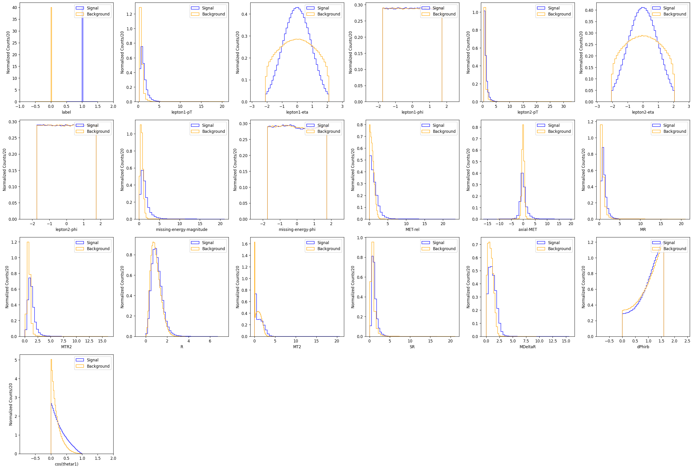
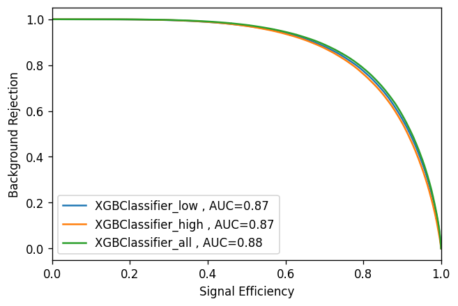
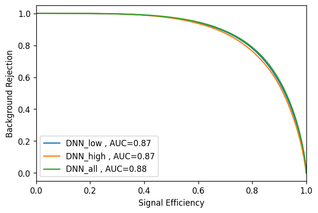

# SUSY Analysis using ML Techniques

SUSY analysis using Machine Learning Techniques. The following ML techniques were used in the study:

1. XGBClassifier (from XGBoost)
2. Deep Neural Network
3. Variational Autoencoder (work still in progress)
4. (To Do) Autoencoder

These ML techniques were trained using low-level features, high-level features and combination of both low-level and high level features.

## Dataset [2]:

1. Signal: The process $\chi^{\pm}~ \rightarrow~ W^{\pm} ~\chi^{o}$ with W boson decaying to lepton and neutrino.
2. Background: Pair of W boson decaying to lepton and neutrino.

## Distribution of input features

## ROC Curve

XGBClassifier for low, high and combination of low and high level features

DNN for low, high and combination of low and high level features

## References:
1. Baldi, P., Sadowski, P. & Whiteson, D. Searching for exotic particles in high-energy physics with deep learning. Nat Commun 5, 4308 (2014). https://doi.org/10.1038/ncomms5308
2. Dataset used from http://archive.ics.uci.edu/ml/datasets/SUSY (Monte Carlo Simulation)
